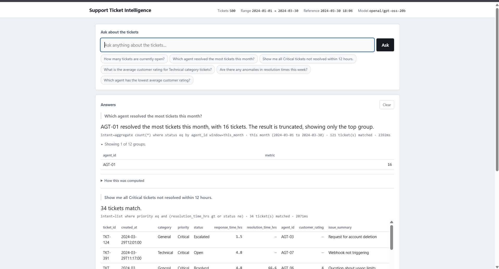
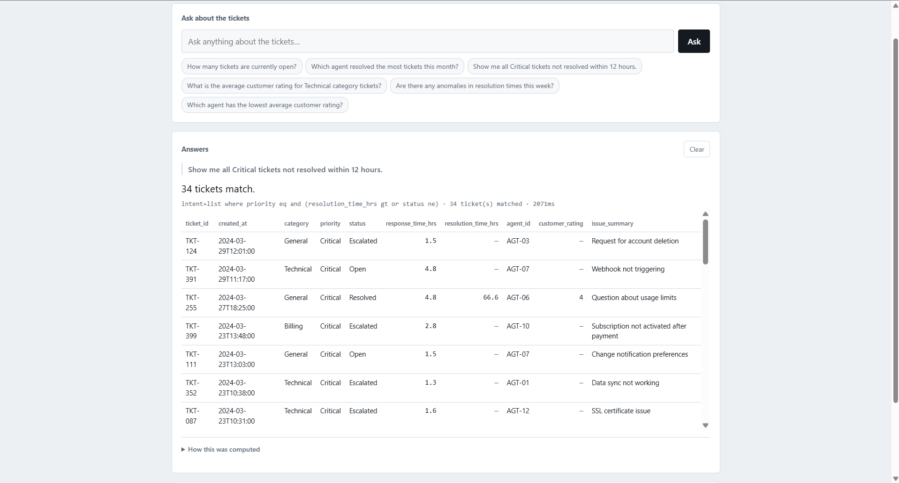
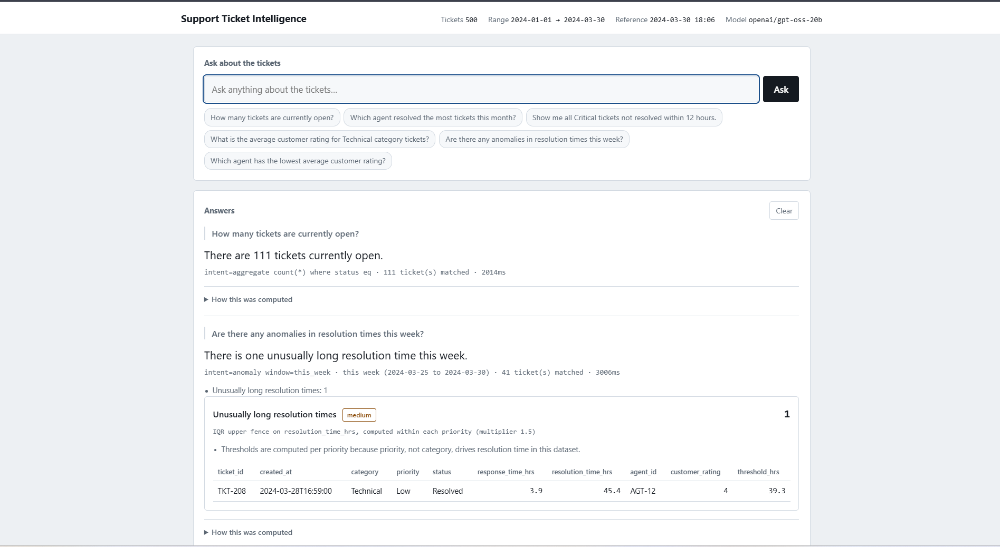

# Support Ticket Intelligence

Support Ticket Intelligence answers natural-language questions about a 500-row
customer-support ticket dataset and flags anomalies in it, through a REST API
and a minimal web UI served from one process. It was built as a 48-hour AI
Engineer take-home assessment for DOTMappers.

The core design decision: the LLM never writes SQL, pandas, or any other
code. Given a question, it emits a `QueryPlan`: JSON drawn from a closed
vocabulary of known columns, a fixed operator set, and enum-checked values.
Pydantic validates that plan, then plain, unit-tested pandas code executes
it; a second LLM call phrases the result as a sentence. The model decides
*what* to compute, never *how*, so it cannot fabricate a number and there is
no code path from its output to code execution. See
[Architecture](#architecture).

## Setup

Developed and tested on Python 3.12. No 3.12-only syntax is used, so
3.11 should work.

```bash
python -m venv .venv
source .venv/bin/activate        # .venv\Scripts\activate on Windows
pip install -r requirements.txt
cp .env.example .env
```

Add a free Groq API key to `.env` (`GROQ_API_KEY=...`). Get one at
[console.groq.com/keys](https://console.groq.com/keys) — no credit card
required. The free tier allows 30 requests per minute, which is enough for
local development and a live walkthrough. Daily caps vary by model and
change over time; Groq's
[rate limits page](https://console.groq.com/docs/rate-limits) has the
current figures for your account (see [Model and tools](#model-and-tools)).

```bash
python run.py
```

The UI and the REST API are both served from
[http://127.0.0.1:8000](http://127.0.0.1:8000); interactive API docs are at
`/docs`.

Two things worth knowing before running it:

- `/api/anomalies` and `/api/health` need no LLM at all, since the anomaly
  detectors are plain pandas. Only `/api/query` needs a model.
- Set `LLM_PROVIDER=ollama` in `.env` to run fully offline, with no API key
  and no network, against a local model through Ollama.

### Tests

```bash
python -m pytest
```

`pytest.ini` already sets `-q`, so no verbosity flag is needed; adding one
suppresses the pass count. 194 tests, run fully offline against a deterministic stub LLM provider — no
API key, no network, no cost. Unit tests build small hand-crafted frames with
known values so assertions can state exact expected numbers;
`tests/test_api.py` runs the real FastAPI lifespan (dataset load and
provider construction exactly as at startup) against the shipped CSV, with
`LLM_PROVIDER` monkeypatched to `stub` for the duration of each test.

On Windows, plain `pytest` can fail with a temp-directory error; use:

```bash
python -m pytest --basetemp .\.pytest-temp
```

## Architecture

The closed vocabulary is defined in `app/query/plan.py`: column names as
`FilterField`, `GroupField` and `MetricField`, a fixed operator set (`eq`,
`gt`, `contains`, `in` and so on), and enum-checked values. A plan that
references anything outside it fails Pydantic validation and never reaches
the executor, which is what makes injection structurally impossible rather
than filtered after the fact.

Execution happens in `app/query/executor.py` in plain pandas, unit-tested
with no model involved. The narration call that follows receives only
numbers Python has already computed, so it has nothing left to calculate.


Purple nodes involve the LLM; green nodes are deterministic Python. The
repair loop only ever feeds the validator's error message back to the
planner; it cannot loosen what counts as valid.

| Path | Responsibility |
|---|---|
| `app/domain/schema.py` | Canonical column names, enums, and alias map — the single source of truth every other module imports from |
| `app/data/` | `loader.py` (CSV ingest, validation, row quarantine), `store.py` (in-memory `TicketStore`, dataset profile) |
| `app/query/` | `plan.py` (the DSL and its strict-mode JSON-schema generator), `executor.py` (pandas execution), `timewindow.py` (relative-date resolution) |
| `app/anomaly/detectors.py` | Five deterministic anomaly detectors |
| `app/llm/` | `base.py` (provider protocol), `groq_client.py`, `ollama_client.py`, `stub.py` (offline test double), `prompts.py`, `factory.py` |
| `app/pipeline.py` | Wires planning → validation → execution → narration together |
| `app/api/main.py` | FastAPI app; serves the REST API and the UI from one process on one port |
| `app/ui/index.html` | Single-page UI, vanilla JS, no build step |
| `tests/` | 194 tests, run fully offline through the stub provider |

### Reference clock

The dataset spans 2024-01-01 to 2024-03-30. Relative terms like "this month"
or "this week" resolve against the newest ticket in the dataset (2024-03-30
18:06), not the real wall clock. Resolving them against today's date would
make every such query match zero rows and look like a broken system. This is
configurable (`REFERENCE_CLOCK=system` switches to the real clock, for live
data), and every response echoes the window it actually resolved to, so the
interpretation is never silently hidden. See the `this month (2024-03-01 to
2024-03-30)` and `this week (2024-03-25 to 2024-03-30)` labels in the
examples below.

### Deliberately not used

Three things a similar project often reaches for are deliberately absent: a
vector database (500 rows, no semantic-search requirement), an agent
framework (the system makes one constrained call per stage, not a
multi-step agent loop), and DuckDB (the plan DSL already covers the query
surface the brief asks for; pandas executes it directly).

One more small design note: the assessment brief spells three columns two
different ways. Its schema-preview table (§3.2) uses
`resp_time_hrs`/`resol_time_hrs`/`cust_rating`, while its column
descriptions (§3.3) use
`response_time_hrs`/`resolution_time_hrs`/`customer_rating`. The
shipped CSV uses the §3.3 spelling, but `app/domain/schema.py` maps both
variants to the same canonical names, so the loader would not break if a
differently-spelled file showed up.

## API and UI

Both are served by the same FastAPI process on the same port, so
`python run.py` is the whole system:

| Method | Path | Notes |
|---|---|---|
| `POST` | `/api/query` | Natural-language question → plan → result. Needs a working LLM provider. |
| `POST` | `/api/anomalies` | Body `{types, window}`. Runs the detectors; no LLM involved. |
| `GET` | `/api/anomalies` | Convenience form of the above: all detectors, all time. |
| `GET` | `/api/health` | Dataset profile, ingest report, LLM reachability, and the active threshold configuration. |
| `GET` | `/api/schema` | Columns, enums, the resolved reference clock, and example questions — what the UI uses for its suggestion chips. |
| `GET` | `/` | The UI. |
| `GET` | `/docs` | Interactive OpenAPI docs, generated by FastAPI. |

If `GROQ_API_KEY` is missing, or the configured provider fails to start, the
API still comes up: `/api/health` and `/api/anomalies` keep working, and
`/api/query` returns a 503 that names the problem instead of the process
crashing at startup.

## Model and tools

Primary provider: **`openai/gpt-oss-20b` on the Groq free tier**. Fallback:
`openai/gpt-oss-120b`. Fully offline: Ollama running `qwen3:4b` (about
2.6 GB, CPU-friendly) or `gpt-oss:20b` (the same weights as the hosted
default; needs roughly 16 GB of RAM).

Reasoning behind that choice:

- The Groq free tier needs no credit card and allows 30 requests per minute,
  comfortably enough for local development and a live walkthrough. Daily
  caps differ per model and change over time, so check Groq's rate limits
  page rather than trusting a figure hardcoded here.
- Groq's **strict Structured Outputs** (token-level constrained decoding
  that guarantees schema-valid JSON) is only available on three models:
  `openai/gpt-oss-20b`, `openai/gpt-oss-120b`, and `qwen/qwen3.8-27b`.
  `gpt-oss-20b` is the fastest of the three, and Structured Outputs cannot
  be combined with tool calling or streaming, so the planner sends a plain
  chat completion with `response_format` rather than a function/tool call.
- `gpt-oss-20b` is Apache 2.0 licensed: a 21B-parameter mixture-of-experts
  model with 3.6B active parameters and a 128K context window. The same
  weights run locally under Ollama, which compiles the JSON schema into a
  GBNF grammar and constrains decoding the same way. One prompt and one
  `QueryPlan` schema (`plan_json_schema()` in `app/query/plan.py`) cover
  both the hosted and the offline path; only the schema *dialect* differs —
  Groq's strict dialect closes every object and forbids `$ref`/`anyOf`,
  Ollama accepts Pydantic's schema unchanged.
- `llama-3.3-70b-versatile` and `llama-3.1-8b-instant`, the models most
  tutorials still reach for, have been retired by Groq. Per Groq's
  deprecations page the retirement was announced on 2026-06-17 and took
  effect on 2026-08-16. `GroqProvider` refuses to start with either
  configured, or with `qwen/qwen3-32b`, also retired, raising an error that
  names the current strict-capable models instead of failing obscurely on
  the first request.
- No fine-tuning: constrained decoding against a fixed schema is a better
  fit for a 48-hour project with one well-defined output shape, and the
  brief gives no reason to train anything.

## Example queries

Every answer below is a real, verified output — either captured from the
running UI with `openai/gpt-oss-20b` on Groq (screenshots included), or
reproduced by running the same code through the deterministic test provider
(`LLM_PROVIDER=stub`), which exercises the identical validation and
execution path with no model involved. The line under each answer is the
debug summary the UI shows under "How this was computed": the resolved
plan, how many tickets matched, and latency.

**1. How many tickets are currently open?**

> There are 111 tickets currently open.

`intent=aggregate count(*) where status eq · 111 ticket(s) matched · 2014ms`

**2. Which agent resolved the most tickets this month?**

> AGT-01 resolved the most tickets this month, with 16 tickets. The result
> is truncated, showing only the top group.

`intent=aggregate count(*) where status eq by agent_id window=this_month · this month (2024-03-01 to 2024-03-30) · 121 ticket(s) matched · 2392ms`



*AGT-01 leads 12 agents with 16 tickets resolved in March 2024; the UI shows
the top group and states that the rest were truncated.*

**3. Show me all Critical tickets not resolved within 12 hours.**

This is the only one of the brief's sample questions that needs OR logic,
since "not resolved within 12 hours" means resolution took over 12h **or**
the ticket is still unresolved. It is therefore the one worth showing the
actual validated plan for:

```json
{
  "intent": "list",
  "filters": [
    {"field": "priority", "op": "eq", "value": "Critical", "values": null}
  ],
  "filters_any": [
    {"field": "resolution_time_hrs", "op": "gt", "value": 12, "values": null},
    {"field": "status", "op": "ne", "value": "Resolved", "values": null}
  ],
  "time_window": null,
  "aggregation": null,
  "group_by": [],
  "sort": null,
  "limit": 100,
  "anomaly_types": [],
  "reasoning": "Critical tickets that either took over 12h or are still unresolved.",
  "unsupported_reason": ""
}
```

`filters` are ANDed together; `filters_any` are ORed together and then ANDed
with `filters`. Every field name, operator and enum value here is checked
against the closed vocabulary before this plan is allowed to run — none of
it is a string an LLM could turn into a different query at execution time.

> 34 tickets match.

`intent=list where priority eq and (resolution_time_hrs gt or status ne) · 34 ticket(s) matched · 2071ms`



**4. What is the average customer rating for Technical category tickets?**

> The average customer rating for the Technical category is 3.7404. This
> calculation excludes 48 tickets that have no rating.

`intent=aggregate avg(customer_rating) where category eq · 152 ticket(s) matched · 3229ms`

152 Technical tickets matched; 48 of them are unresolved and therefore have
no rating, leaving 104 rated tickets in the average.

**5. Are there any anomalies in resolution times this week?**

> There is one unusually long resolution time this week.

`intent=anomaly window=this_week · this week (2024-03-25 to 2024-03-30) · 41 ticket(s) matched · 3006ms`



*The same screenshot also shows example 1 above it — this is one continuous
session in the UI, not two separate runs.*

**6. Which agent has the lowest average customer rating?**

Run through the deterministic test provider, so the sentence below is the
system's own template fallback rather than LLM prose. The number is
identical either way, since narration never touches the arithmetic:

> AGT-08 is lowest at 3.48.

`intent=aggregate avg(customer_rating) by agent_id · 500 ticket(s) matched`

AGT-08's mean is exactly 3.4800 over 25 ratings; AGT-11 is next at 3.4828
over 29 ratings. The two look tied at two decimal places and are not. The
executor compares full-precision values, and reports a `ties` list
explicitly when a tie is genuine.

**7. Who is the customer on ticket TKT-001 and what is their phone number?**

> The dataset has no customer name or contact columns; it only covers
> ticket metadata, timings, agent and rating.

A question like "show me the top 5 customers by ticket count" gets the same
treatment. This is the planner's shipped refusal behaviour, not a special
case bolted onto the executor: the closed-vocabulary schema simply has no
customer field to point at, so the system prompt's rule ("if the question
cannot be expressed with these columns and operators, set intent to
`unsupported` and explain why, never guess") applies, and the plan never
reaches the executor. Wording verified against the shipped few-shot example
in `app/llm/prompts.py`, which is round-tripped through
`QueryPlan.model_validate()` at import time, so a malformed example would
fail to import rather than just fail at runtime.

**8. Anomaly scan — all detectors, all time.**

`GET /api/anomalies`, or "are there any anomalies" with no time window: 234
flags across 179 distinct tickets, since a ticket can trip more than one
detector. Note that the response's own `distinct_tickets_shown` field reads
154, not 179: each detector's ticket list is capped at 50 by
`MAX_ANOMALIES_PER_DETECTOR`, so that field counts only the tickets actually
listed. The per-detector `count` values are always exact. Those counts and
the reasoning behind each threshold are in
[Anomaly detection](#anomaly-detection) below.


## Evaluation

The system was evaluated against the assessment brief’s five sample queries and the project’s automated test suite.

* **Sample-query accuracy:** All five sample queries return results matching values independently verified against the dataset.
* **Automated testing:** **194 tests pass** using a deterministic stub provider.
* **Offline test execution:** Tests run without a live LLM, API key, or network connection.
* **Core logic coverage:** The stub’s prepared responses still pass through the application’s normal query-plan validation and pandas execution path.

The stub-based tests verify the application’s validation and execution logic; they do not establish that a live LLM will always produce a correct query plan.


## Anomaly detection

No model is involved in any of this — every detector is plain pandas over
the dataset, unit-tested independently of the LLM.

| Detector | Rule | Flags (of 500) |
|---|---|---|
| `resolution_outlier` | IQR upper fence on `resolution_time_hrs`, computed **within each priority** (multiplier 1.5) | 18 |
| `aging_unresolved` | High/Critical, still Open or Escalated, older than 24h | 80 |
| `response_sla_breach` | `response_time_hrs` over a fixed per-priority target (Critical 2h / High 4h / Medium 6h / Low 12h) | 61 |
| `low_rating` | `customer_rating` ≤ 2 | 47 |
| `data_integrity` | Resolved before first response, or resolution/rating fields disagreeing with status | 28 |

Groups smaller than 8 tickets are skipped rather than given a statistically
meaningless fence.

Two calibration decisions are worth explaining, since neither is the
obvious default:

**Resolution-time outliers are grouped by priority, not category.** Median
resolution time barely varies by category, at Billing 11.4h, General
12.05h and Technical 13.15h, so a category-based fence carries almost no
signal. It
varies enormously by priority: Critical 3.7h, High 6.9h, Medium 14.5h, Low
26.6h. A single global IQR fence (cutoff 48.15h) flags 21 tickets, but it is
dominated by Low-priority tickets that are perfectly normal for their class,
and it misses Critical tickets running at five times their own class's
median. Grouping by priority instead flags 18, correctly split 2 Low / 6
Medium / 7 High / 3 Critical.

**First-response SLA breaches use a fixed target, not a statistical fence.**
`response_time_hrs` is close to uniformly distributed on [0.2, 5.0]
(quartiles 1.4 / 2.6 / 3.9) regardless of priority, so its IQR fence sits at
7.65h and would never fire. Response time and priority are essentially
uncorrelated in this dataset, which is itself a finding worth surfacing
rather than a reason to drop the detector. Fixed per-priority targets flag
61 tickets instead.

The aging-unresolved detector matches 80 of the 80 unresolved High/Critical
tickets in scope, because the file spans three months with nothing
backfilled as resolved. That is correct given the rule as stated in the
brief, not a bug in the detector; see [Known limitations](#known-limitations).

## Known limitations

- The aging-unresolved detector flags every unresolved High/Critical ticket
  in this dataset (80 of 80) because the file spans three months with no
  backfilled resolutions. `AGING_HOURS` is configurable, and the detector
  says so in its own note when it fires this broadly.
- The query DSL has no nested boolean logic beyond one AND-of-`filters`
  combined with one OR-of-`filters_any`. There is no support for arbitrary
  parenthesised expressions.
- No multi-hop or comparative questions (for example, "compare Q1 to Q2 for
  agents who...").
- Single process, in-memory pandas. Right for 500 rows; a real store would
  be needed beyond roughly a million rows.
- No conversation memory — each question is planned independently of any
  question asked before it.
- The Groq free tier allows 30 requests per minute. Each question costs two
  calls, one to plan and one to narrate, so sustained use can reach that
  ceiling; set `NARRATE_ANSWERS=false` to halve it.
- `issue_summary` is only matched with `contains`, a case-insensitive
  substring check. There is no semantic or fuzzy search over it.
- Timestamps are naive (no timezone). A deployment spanning multiple
  timezones would need that handling added.

## Scaling notes

`QueryPlan` is the stable interface between the model and the data, so
nothing above the executor would need to change to swap the backend. At
real scale: compile the same plan to parameterised SQL against DuckDB or
Postgres instead of pandas; cache plans by normalised question text; run
the anomaly detectors as a scheduled job that writes to a flags table
instead of computing them per request; add per-user rate limiting in front
of the LLM calls.

## Project structure

```
support-ticket-intelligence/
├── app/
│   ├── anomaly/
│   │   └── detectors.py
│   ├── api/
│   │   ├── main.py
│   │   └── models.py
│   ├── data/
│   │   ├── loader.py
│   │   └── store.py
│   ├── domain/
│   │   └── schema.py
│   ├── llm/
│   │   ├── base.py
│   │   ├── factory.py
│   │   ├── groq_client.py
│   │   ├── ollama_client.py
│   │   ├── prompts.py
│   │   └── stub.py
│   ├── query/
│   │   ├── executor.py
│   │   ├── plan.py
│   │   └── timewindow.py
│   ├── ui/
│   │   └── index.html
│   ├── config.py
│   └── pipeline.py
├── data/
│   └── support_tickets.csv
├── docs/
│   └── images/
├── tests/
│   ├── conftest.py
│   ├── test_anomaly.py
│   ├── test_api.py
│   ├── test_executor.py
│   ├── test_loader.py
│   ├── test_pipeline.py
│   └── test_plan.py
├── .env.example
├── .gitignore
├── pytest.ini
├── requirements.txt
├── ruff.toml
└── run.py
```

Package `__init__.py` files are omitted above for readability.

## Author

**Muhammed Nayifuddin**  
CSE (AI&ML) Student  
Neil Gogte Institute of Technology (NGIT)  
📧 [mohdnayif799@gmail.com](mailto:mohdnayif799@gmail.com)  
🔗 [GitHub](https://github.com/mohdnayif799) · [LinkedIn](https://www.linkedin.com/in/muhammed-nayifuddin/)
